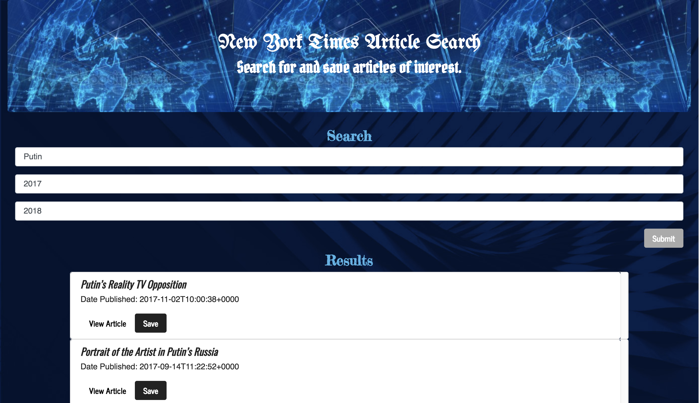

# New York Times Article Scraper React.js

## Overview
This is the React.js app. Whenever a user visits this site, the app allow user to search news from a NewYorkTimes website and display them for the user. EAfter performing a search, the user will see article results including the name of the article, the date and time of publishing, and a button linking to the article source. Finally, users are able to add and remove articles from a saved articles section.

## Link for heroku website 
https://hidden-mesa-87369.herokuapp.com/

## Screenshots

## Technologies Used

* MongoDB
* Express
* React
* Node
NPM packages:
* mongoose
* body-parser
* bluebird
* axios
* react
* react-dom
* react-router-dom
* react-scripts

